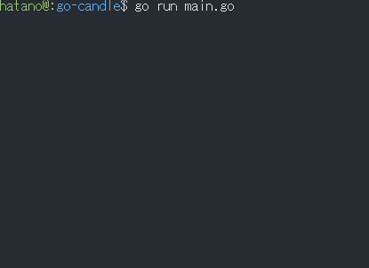

# What is this?
Fire effect written in Golang.<br>
Seeing fire make you feel calm.

## How to get and run the code.
### build version
go1.12.17
### 1st step
Get the code.
```
go get -d github.com/y-hatano-github/go-candle
```
### 2nd step
Change directory to the source code directory.
```
cd $GOPATH/src/github.com/y-hatano-github/go-candle
```
### 3rd step
Run the code.
```
go run main.go
```
Terminal which run this app must support 256 colors.

## Key bindings
[esc / CTRL+C] - exit<br>

## Win/Mac/Linux binary
https://github.com/y-hatano-github/go-candle/releases/
